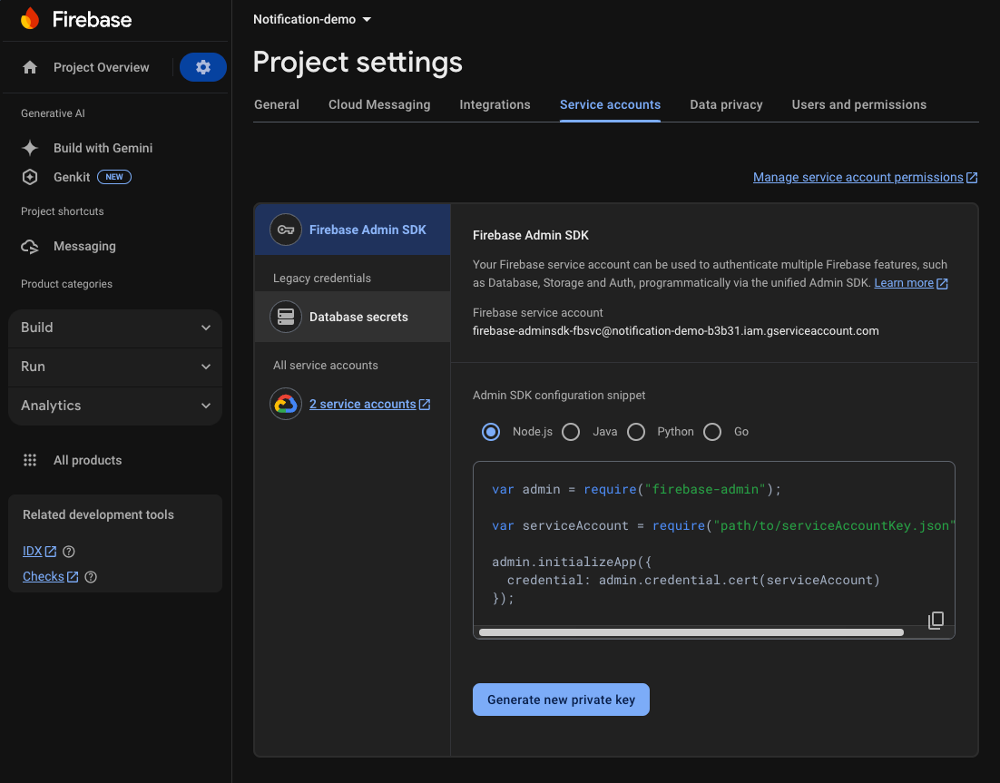
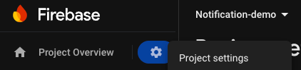
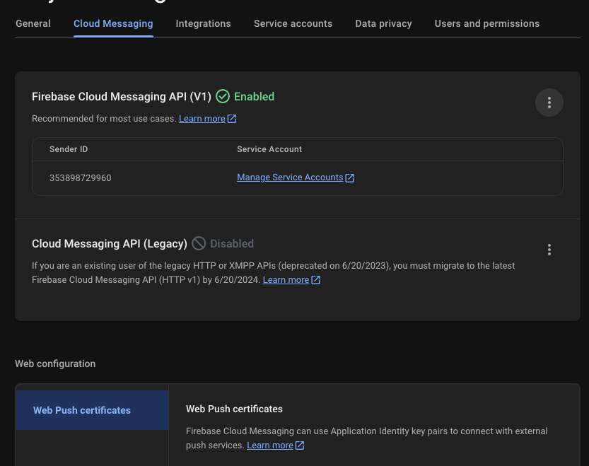
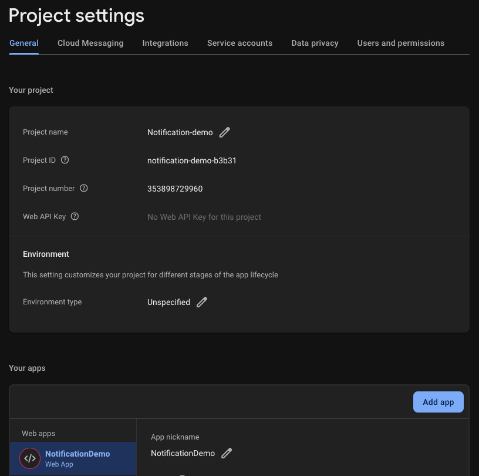

# Firebase Push Notifications with Spring Boot and React

This project demonstrates how to implement push notifications using Firebase in a system built with **Spring Boot** for
the backend and **React** for the frontend. It provides an example of a complete workflow to send and receive
notifications in real-time, showcasing integration between Firebase Cloud Messaging (FCM), a Java-based backend, and a
React-based frontend.

### Note:
Besides this being a `web` demo, Firebase Cloud Messaging (FCM) is also compatible with `iOS` and `Android` platforms. The implementation for mobile applications can utilize the respective Firebase SDKs for these platforms, allowing seamless integration and notification delivery across devices.


## Features

- Backend built with **Spring Boot** to manage Firebase integration and notification dispatch.
- Frontend built with **React** to display push notifications in a browser as an example client.
- Utilization of **Firebase Cloud Messaging (FCM)** for reliable notification delivery.
- Handles notification subscription and token management.
- Real-time notifications shown in the React frontend.

---

## Getting Started

### Prerequisites

Make sure you have the following tools installed:

- **Java 17 or above** (for Spring Boot)
- **Node.js 18+** and **npm** (for React)
- **Firebase project** setup with Cloud Messaging enabled

---

### 1. Backend Setup: Spring Boot

1. **Clone the Repository**:
   ```bash
   git clone <repository-url>
   cd backend
   ```

2. **Configure Firebase**:
    - Download your Firebase service account key `service-account.json` from the Firebase console.
    
    - Place the file into the `src/main/resources` directory.

3. **Build and Run the Spring Boot Application**:
   ```bash
   ./mvnw spring-boot:run
   ```

4. **Endpoints**:
    - `/notification` — Endpoint to send notifications.

---

### 2. Frontend Setup: React

1. **Navigate to the Frontend Directory**:
   ```bash
   cd frontend
   ```

2. **Install Dependencies**:
   ```bash
   npm install
   ```

3. **Firebase Setup in React**:
    - Create a `.env` file in the `notification-demo` folder containing the Firebase configuration:
      ```dotenv
         VITE_FIREBASE_API_KEY=<YOUR_API_KEY>
         VITE_FIREBASE_AUTH_DOMAIN=<YOUR_AUTH_DOMAIN>
         VITE_FIREBASE_PROJECT_ID=<YOUR_PROJECT_ID>
         VITE_FIREBASE_STORAGE_BUCKET=<YOUR_STORAGE_BUCKET>
         VITE_FIREBASE_MESSAGING_SENDER_ID=<YOUR_MESSAGING_SENDER_ID>
         VITE_FIREBASE_APP_ID=<YOUR_APP_ID>
         VITE_FIREBASE_VAPID_KEY=<YOUR_VAPID_KEY>
      ```
              

        - Vapid key:
          In firebase project settings, go to `Cloud Messaging` > `Web Configuration` and create a new `Key pair`
          
        - Rest of the variables:
          In firebase project settings, go to `General` press `Add app` in case you have not done it yet, then copy the
          values generated there
          

4. **Run the React Application**:
   ```bash
   npm run dev
   ```

5. **Features**:
    - Subscribes users to push notification services.
        - when the application runs, it will generate a log saying
          `this token is needed for server side push notifications: ${token}` copy that token as it will work as the `recipientToken`
    - Processes and displays notifications when received.

---

## How to Send a Notification

1. Make a POST request to the backend API endpoint to send a push notification:
   ```bash
      curl -X POST --location "http://localhost:8080/notification" \
            -H "Content-Type: application/json" \
            -d '{
            "recipientToken": ${recipientToken},
            "title": "Dummy title",
            "body": "Dummy body",
            "imageUrl": "any imageUrl",
            "data": {
                "key1": "anything",
                "key2": "something else"
            }
            }'
   ```

   - `recipientToken`: The unique token generated by Firebase for the specific client/device which will receive the notification.
   - `title`: The title of the notification displayed to the user.
   - `body`: The main message or body of the notification.
   - `imageUrl`: _(Optional)_ A URL pointing to an image that will be shown in the notification (if supported).
   - `data`: _(Optional)_ A custom data object to include additional information with the notification.
       - `key1`: An example of a key-value pair that can contain any additional custom data.
       - `key2`: Another example of a key-value pair for custom data.
  

2. The React frontend will display the notification once received.

---

## Example Workflow

1. **User Visits the Frontend**:
    - The React app initializes Firebase messaging and retrieves a token for the client.

2. **Backend Sends Notifications**:
    - The Spring Boot backend dispatches messages to specific tokens using Firebase Cloud Messaging.

3. **Notifications Displayed on the Client**:
    - The frontend receives and displays the push notification in real-time.

---

## Tools and Technologies Used

- **Backend**:
    - Spring Boot
    - Firebase Admin SDK
- **Frontend**:
    - React
    - Firebase Web SDK
    - react-toastify (for UI notifications)
- **Build Tools**:
    - Maven (for backend)
    - Vite (for frontend)

